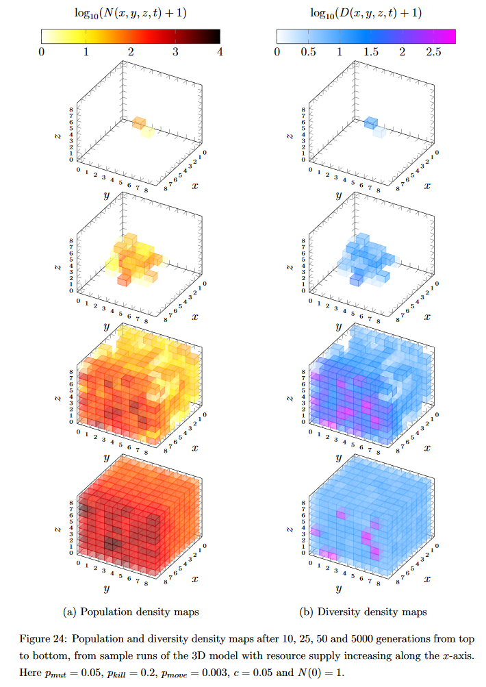

# Simulating tumour development in two and three dimensions using the framework of the spatial Tangled Nature model

[](https://travis-ci.com/dominicpalmer/spatial-tangled-nature) 

**Dominic Palmer - MSc Project - Imperial College London - 2018**

## Summary
My MSc project centred around the creation and analysis of two and three dimensional coarse-grained simulations of tumour development using the mathematical framework of the spatial Tangled Nature model. The simulations are genetic algorithms built on the notion of a lattice of nodes, each of which can sustain a population of cells with the ability to replicate, mutate, die, or relocate to a neighbouring node with some functional probability. This repository contains the source code of the three-dimensional model.

Various constraints were put in place and tested to examine how varying the simulations' initial state and underlying environment affects growth rates, 'tumour' heterogenity and response to simulated treatment. By varying parameters both locally (per node) and globally (per lattice) to simulate a range of environments and cell types, I reached conclusions on growth rates for both tumours in vivo and those experimentally grown that aligned with existing bodies of research. The mathematical model at the heart of these simulations was created by Christensen et. al [[1]](#references), originally aimed at simulating evolutionary ecology. For further reading on the Tangled Nature model, [[2]](#references) provides an overview.

Below is a plot from my MSc thesis that highlights the impact of resource allocation on growth in terms of population *N* and population density *D*.

<p align="center">
    
</p>

## Prerequisites
The simulation requires a number of parameter constants specific to the Tangled Nature model to be defined by the user, such as the probability of cell mutation, `P_MUT`. Some parameters aren't so self explanatory, such as coefficients used in the calculation of weight functions. As such, some familiarity with the model underpinning the code is required for sensible parameter assignment.

## Dependencies
None for the 3D simulation. GoogleTest for tests. The projects are GNU Make based and compile cross platform. On Linux I recommend using the native GNU toolchain, Clang if using OSX, and mingw-w64 or MSYS2 on Windows. Commands to make use of LLVM tools clang-tidy and clang-format are integrated into the makefiles, plus Valgrind for running memory checks.

## Build and Run
Clone the project:

```bash
$ git clone https://github.com/dominicpalmer/spatial-tangled-nature.git
```

Next, clone GoogleTest into a directory named **lib**:

```bash
$ cd spatial-tangled-nature
$ mkdir lib
$ cd lib
$ git clone https://github.com/google/googletest.git -b release-1.10.0
```

To build and run the 3D simulation executable using g++ with -std=c++17, first define the simulation constraints in **params.h**, then run the following from the root directory:

```bash
$ cd stn3d
$ make
$ bin/stn3d
```

All simulation output is written to an **out** directory created at the invocation path. Clear the output by running *make clean*.

## Tests
From the projects root directory, build and run all tests for the 2D model via:

```bash
$ cd stn3d
$ make tests
$ bin/stn3d_tests
```

## Output
Upon execution, the program will first log initial conditions and parameters to a file named **initial_state_log.txt** in the **out** directory. An additional log named **population_log.txt** is created and updated with the total population of the lattice at each generational step.
Log files are also created and updated for each lattice point, named according to their lattice coordinates, e.g. **existent_genotypes_123.txt**. These logs track the 'genetic' diversity of the population at each lattice point. Written to them on a row by row basis at each generational step are all existent 'genotypes' local to the point, denoted in base 10.

## License
MIT licensed.

## References
[1] CHRISTENSEN, K., DI COLLOBIANO, S., HALL, M. and JENSEN, H. (2002). Tangled Nature: A Model of Evolutionary Ecology. Journal of Theoretical Biology, 216(1), pp.73-84.

[2] LAIRD, S., LAWSON, D. and JENSEN, H. (2008). The tangled nature model of evolutionary ecology: an overview. Mathematical Modelling of Biological Systems, 2(1), pp.49-62.